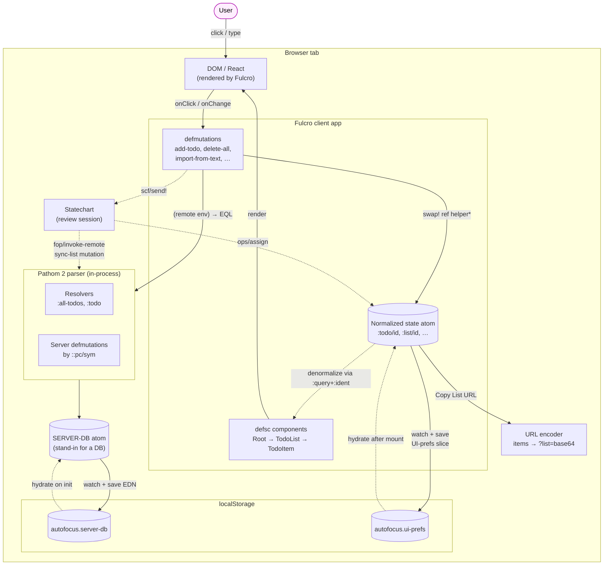

# AutoFocus — system overview

How the technologies fit together in this project. The whole stack
runs in the browser — there is no network. The "server" is a CLJC
namespace (`learn.server`) holding an atom; Pathom is in-process via
a synchronous `sync-remote` shim. This intentional choice means the
learning surface is "real Fulcro/Pathom shape, fake transport."

## What each piece does

- **`defsc` components** declare three things: `:query` (the data they need), `:ident` (their identity in the normalized state), and `:initial-state` (the shape they expect on mount). Fulcro stitches them into a tree starting at `Root`.
- **`defmutation`s** are the only way state changes. `action` runs locally (optimistic update); `remote` returns truthy iff the mutation should also be sent to a remote — in our case the Pathom parser, which writes through to `SERVER-DB`.
- **The state atom** is normalized: entities live by ident (`[:todo/id <uuid>]`), and references are stored as those idents — never as nested maps. Denormalization is automatic at render time.
- **Pathom resolvers** read from `SERVER-DB` and shape the output to whatever EQL the client asked for. **Pathom defmutations** are the inverse — they take the client's mutation and apply the write to `SERVER-DB`.
- **`SERVER-DB`** is the "source of truth" — the same shape SQL/Datomic would hold. A watcher serializes it to localStorage on every change.
- **The statechart** drives the prioritization review flow (`inactive ↔ active`). It reads list state via the data-model integration and writes back through `ops/assign` for client state + `fop/invoke-remote` for the server sync.
- **URL encoder** is currently one-way (build a share URL from current items). The decoder and conflict-modal stories are still ⬜ (see [`../user_stories.md`](../user_stories.md) "Planned").

## What's missing

- **No real network.** "Remote" is a CLJC function call. Pathom is in-process. The Fulcro shape is faithful; the transport isn't.
- **No RAD.** All defsc / forms / reports are hand-written. RAD is documented separately in [`fulcro-rad.md`](./fulcro-rad.md) as a reference.
- **One entity, one list.** The whole stack is sized for the AutoFocus model. Multi-entity / multi-list patterns aren't exercised.

\* "ref helper" = the pure `*`-suffixed state-helper fns in `learn.client` that the `action` blocks `swap!` through (e.g. `add-todo*`, `delete-all*`). They project normalized state into denormalized items, delegate to `learn.model.list` for domain logic, and project the result back. See [`../SCHEMA.md`](../SCHEMA.md) §10.
