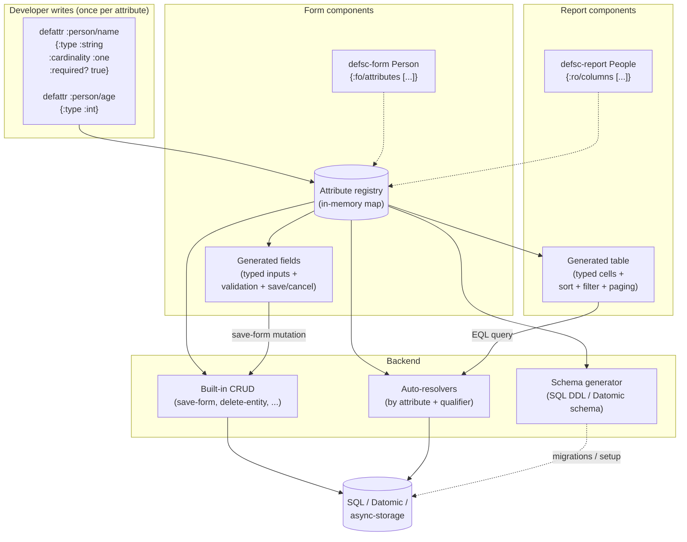

# Fulcro RAD — attribute-driven CRUD

**We don't use RAD in AutoFocus.** This page exists as reference —
RAD is the obvious next step for projects with multiple entities and
heavy CRUD shapes, and Phase 9/10 on the roadmap covers it.

The big idea: instead of hand-writing a `defsc` per entity-view +
matching mutations + matching server resolvers, you write **one
attribute definition per field** and let RAD derive the rest. Forms,
reports, and the backend schema all consume the same attribute
registry.

## What RAD adds (vs plain Fulcro)

| You'd write by hand | RAD generates from attributes |
|---|---|
| `defsc PersonForm` with field components, refs, validation, save action | `defsc-form` referencing a list of attribute keys |
| `defsc PeopleReport` with column components, sort handlers, filter UI | `defsc-report` with `:ro/columns` |
| Pathom resolver for every read shape (`:person/name-and-age`, …) | Auto-resolver per attribute + qualifier |
| Pathom defmutation for save / delete / merge | Built-in `save-form!`, `delete-entity!`, etc. |
| SQL DDL / Datomic schema by hand, kept in sync with the client | Schema generated from the attribute registry |

## Where RAD shines

- Projects with **many entities** having similar CRUD shapes — admin dashboards, business apps with 20+ tables.
- Teams that want a **single source of truth for the data model** across client + server + DB.

## Where RAD doesn't help much

- Projects with **one or two entities** and **custom UI** (AutoFocus is exactly this — the review flow is the product, not a CRUD form).
- Cases where you want **fine-grained UI control** that RAD's defaults push back on.

## In this project

- Not used. The single Todo entity is shaped by `:todo/id`, `:todo/text`, `:todo/status`, `:todo/was`. The list (singleton, id=1) holds a vector of todo idents.
- Phases 9 and 10 in [`../phases.md`](../phases.md) plan a "port to RAD" exercise — primarily for the learning value rather than because the project needs it.
- Tradeoff is recorded in [`../phases.md`](../phases.md)'s end-of-arc discussion: with one entity, RAD's payoff is modest. If we ever add a second entity (a settings table, a tag table, a per-user prefs table), the calculus changes.
