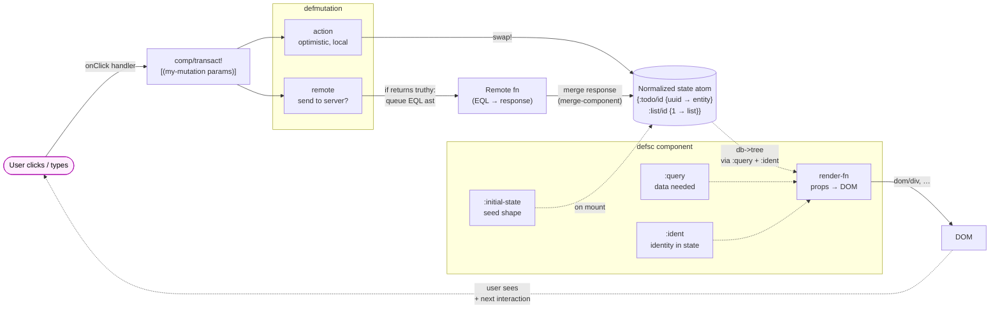

# Fulcro — the render / mutate loop

Fulcro is "React but with a normalized client database and EQL
queries on the components." Each component declares **what data it
needs** (`:query`), **what its identity is** (`:ident`), and **what
default state it should have on mount** (`:initial-state`). Fulcro
stitches the queries into a tree, runs it against the state atom,
and re-renders the affected subtrees when state changes.

Mutations are the *only* way state changes. They have a local
`action` (optimistic update, runs immediately) and an optional
`remote` (returns truthy iff the mutation should also be sent to a
remote like Pathom).

## Key ideas the diagram encodes

1. **One source of truth.** Every `defsc` component renders from the same normalized state atom. There is no per-component state to keep in sync.
2. **Idents are pointers.** When `TodoList` queries `{:list/todos (get-query TodoItem)}`, the state holds `[[:todo/id <uuid>] …]`, NOT the entity maps. Denormalization happens at render via `db->tree`, which follows the idents.
3. **Mutations are atomic and dispatchable.** `(comp/transact! this [(add-todo {:todo/text "x"})])` is a *value* describing a write. Fulcro runs `action` synchronously and queues the remote separately. Two completely independent code paths share the same call site.
4. **Re-render is automatic but targeted.** Only the components whose query results actually changed re-render. The state-atom watcher tracks which idents/paths changed and walks the component tree to find subscribers.
5. **`:initial-state` composes top-down.** `Root`'s initial state names `TodoList`'s initial state names `TodoItem`'s initial state. On mount, Fulcro builds the full tree and normalizes it into the atom in one shot.

## In this project

- See `src/learn/client.cljc` for all `defsc` and `defmutation` definitions — single namespace by design (`learn.client` is the hub; helper namespaces are factored out only when a third caller appears).
- The "Remote fn" is `learn.util.remote/sync-remote` — a CLJC shim that hands the EQL AST straight to the Pathom parser in-process. No HTTP. See [`autofocus-overview.md`](./autofocus-overview.md) for how Pathom + SERVER-DB sit behind it.
- The `*`-suffixed pure helpers (`add-todo*`, `delete-all*`, …) live in `learn.client` alongside the mutations. They do `state-map → state-map` and are exhaustively spec-tested without touching the live atom. The `action` body is a one-liner `(swap! state add-todo* ref text)`.
