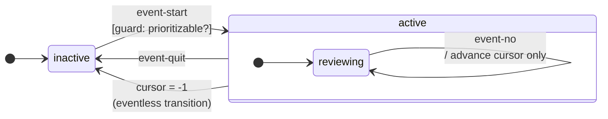

# Statecharts — by example (the review chart)

Statecharts are an SCXML-inspired generalization of state machines:
states can nest, can run in parallel, can be entered with history,
and transitions can carry guards + entry/exit actions. The chart
holds **working memory** (which states are active, plus a data
model). Events drive transitions; transitions may fire actions that
mutate the data model or send further events.

The most concrete way to learn the shape is by reading a real one.
The AutoFocus review flow is small enough to fit on screen:

## How to read it

- **`[*]`** is the conceptual "start" / "end" pseudo-state. The arrow from `[*]` to `inactive` is the initial transition — the chart starts there.
- **`event-start`** is an external event (sent by `scf/send!` from the Fulcro app when the user clicks Prioritize). The bracketed `[guard]` is a predicate function that gates the transition; if it returns false the transition is skipped.
- **`/ action`** after an event name describes the side effect that fires when the transition is taken. Here `mark cursor :ready` mutates the client state-map via `ops/assign`, and `advance cursor` updates the chart's local data-model.
- **Self-loops** (`reviewing → reviewing`) re-enter the same state. They still execute the action; they're not no-ops.
- **The eventless transition** `cursor = -1 → inactive` is a guard-only transition that fires *whenever* the condition becomes true after a microstep. This is how the chart automatically pops back to `inactive` when the cursor walks off the end of the list.

## The framework's moving parts (in prose, not in the diagram)

Things every statechart needs:

| Piece | What it is | Where it lives |
|---|---|---|
| **Chart definition** | The `(statechart …)` form: states, transitions, events, guards, actions | `learn.review.chart/chart` |
| **Working memory** | Mutable record of active states + the data model | Per session, managed by the runtime |
| **Event queue** | FIFO of pending events | Per session, managed by the runtime |
| **`env`** | Whatever context guards/actions need: `:fulcro/app`, custom services | Set at install time via `:extra-env` |
| **Data model** | Session-local key-value store, plus (in Fulcro integration) the live state-map | `(:fulcro/state-map data)` inside expression fns |

Things the chart talks to:

- **`scf/send! app session-id event-name event-data`** — push an event onto the queue from outside the chart (typically a Fulcro mutation or click handler).
- **`scf/process-events! app`** — drain the queue and run microsteps until quiescent. In our tests we install with `:event-loop? false` and pump manually so the test stays deterministic.
- **`ops/assign`** (data-model ops) — modify the chart's data model (or, in the Fulcro integration, the Fulcro state-map directly via path expressions).
- **`fop/invoke-remote`** (Fulcro integration ops) — fire a remote mutation as a chart action. In the review chart this is how the `:yes` action ships the promoted item to `SERVER-DB`.

## In this project

- **One chart, one session.** `learn.review.chart` is the only chart; one session per app, keyed by `:review-session`. See `src/learn/review/chart.cljc`.
- **No nested or parallel states.** The chart is intentionally shallow — `inactive` is atomic, `active` has one inner state (`reviewing`). Phase 11 ("statecharts in depth") would explore deeper hierarchies / parallel regions / history.
- **State subscriptions are explicit in TodoList's `:query`** — the two ident-join keys near the end of `TodoList`'s query (`[:com.fulcrologic.statecharts/session-id :review-session]` and `[:com.fulcrologic.statecharts/local-data :review-session]`) make Fulcro's renderer aware that this component depends on chart state, so it re-renders when the chart's `:cursor` or active states change. Without those joins the headless tests still pass (they call `h/render-frame!` after every click) but the browser doesn't.

## Reference

- Skill: the local `statechart` skill defines the elements (`state`, `transition`, `parallel`, `history`, …) and the Fulcro integration helpers (`scf/*`, `fop/*`). See `~/.claude/skills/statechart/` for the full reference text.
- SCXML W3C spec: <https://www.w3.org/TR/scxml/> — the conceptual lineage.
- David Harel's original "Statecharts: A Visual Formalism for Complex Systems" (1987) — the academic root.
