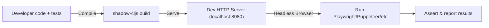
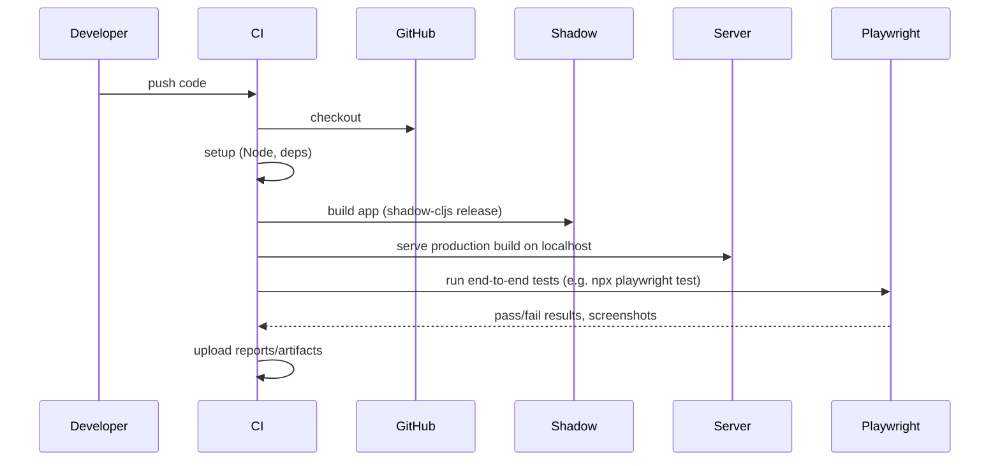

# E2E tool research — Playwright / Puppeteer / Selenium survey

> **Status:** Phase 20 prep snapshot, May 2026. Generic tool survey done
> before this project committed to a browser-automation framework. The
> project ultimately picked **Playwright** — see
> `docs/e2e_test_research.md` for the project-specific synthesis (which
> folds in lessons from the earlier `fp-autofocus` and `pwa-autofocus-app`
> iterations) and the `e2e/` directory for the live Playwright suite.
> Preserved here as the upstream research input that fed those decisions;
> not current guidance. Refer to `e2e/README.md` and the suite itself for
> how E2E actually works in this repo today.

---

## Summary

This document provides a comprehensive **terminal-based workflow** for end-to-end testing of Fulcro (ClojureScript/React) web apps built with **shadow-cljs**. We evaluate popular browser automation tools (Selenium/WebDriver, Puppeteer, Playwright) and their compatibility with Fulcro/shadow-cljs, covering setup, examples, CI integration, and Fulcro-specific strategies. It includes **sample commands, code snippets, CI YAML**, and best practices (e.g. seeding state, mocking, selectors, flakiness mitigation). Key recommendations: use a Node-based framework like **Playwright** or **Puppeteer** with headless Chrome, serve the built app via `:dev-http` in shadow-cljs, and leverage Fulcro's SSR or state-bootstrapping helpers for test stability. The tables and checklist at the end summarize tool features and a minimal handoff template.

## Tool Compatibility (Fulcro + shadow-cljs)
- **Fulcro/shadow-cljs:** Fulcro apps compile to standard HTML/JS (React). Any WebDriver or headless-browser tool that can drive a normal SPA will work; there is no special "shadow DOM" barrier since Fulcro does not use real Shadow DOM by default. CSS-in-JS or generated class names in Fulcro may require stable selectors (e.g. `data-testid` attributes) in tests. Client-side routing (HTML5 `pushState`) is supported, so tests can navigate by URL or by clicking links. Fulcro's remote calls (transit/EDN via AJAX or WebSockets) are transparent to the browser — they appear as network requests that can be awaited or stubbed by the test tool.

- **Selenium/WebDriver:** A mature, language-agnostic framework. Selenium supports **many languages** (Java, Python, JavaScript, C#, Ruby, PHP, etc.) and all major browsers (Chrome, Firefox, IE/Edge, Safari). Headless mode is available (e.g. `ChromeOptions.addArguments("--headless")` or `--headless=new`). Pros: very broad ecosystem (Grids, cloud services) and multi-platform. Cons: complex setup (browser drivers required), verbose API, and no built-in tools for network interception or React-specific waits (it uses the W3C WebDriver HTTP protocol). Example Node install:
  ```bash
  npm install selenium-webdriver   # Official WebDriver JS binding
  ```
  In Selenium tests you build a `WebDriver` (e.g. ChromeDriver) and perform actions like `driver.findElement(...)`. Selenium can run headless but often requires additional browser binaries.

- **Playwright:** A modern cross-browser automation library with its own test runner. Supports **Node/TypeScript, Python, Java, .NET** and automates Chromium (Chrome/Edge), WebKit (Safari), and Firefox. Installation is simple:
  ```bash
  npm init playwright@latest   # scaffolds config and tests
  # or
  npm install -D @playwright/test
  npx playwright install        # downloads browser binaries
  ```
  Playwright's test runner auto-waits for elements (no need for explicit sleeps), has built-in fixtures, and can intercept network and WebSocket traffic. It's **bi-directional** (captures console logs). It is **headless by default** and highly reliable. Pros: cross-browser (incl. Safari), integrated test framework, auto-waiting, rich selectors (text, XPath, shadow DOM) and easy mocking. Cons: newer project (growing ecosystem, no IE support). Example usage:
  ```js
  // example.playwright.spec.js
  const { test, expect } = require('@playwright/test');
  test('login flow', async ({ page }) => {
    await page.goto('http://localhost:8080');
    await page.fill('#user', 'admin');
    await page.fill('#pass', 'secret');
    await page.click('#login');
    await expect(page).toHaveURL('/dashboard');
  });
  // Run with: npx playwright test
  ```
  You can also use `page.route()` or `page.routeWebSocket()` to stub or inspect AJAX/WebSocket calls.

- **Puppeteer:** A Node.js library for Chrome (and recently Firefox) automation. Install with:
  ```bash
  npm i puppeteer          # automatically downloads compatible Chromium
  ```
  Puppeteer has an easy API and downloads a working Chromium. Pros: very simple setup, maintained by Google, *bi-directional* (can capture console/output). Cons: limited browser support (only Chrome/Chromium, Firefox), no official parallel runner (must orchestrate multiple Node processes), and requires manual waits or `page.waitForSelector`. Example script:
  ```js
  // example.puppeteer.js
  const puppeteer = require('puppeteer');
  (async () => {
    const browser = await puppeteer.launch({ args: ['--no-sandbox','--disable-setuid-sandbox'] });
    const page = await browser.newPage();
    await page.goto('http://localhost:8080');
    await page.click('#submit');
    // ... assert results ...
    await browser.close();
  })();
  ```
  *(On Linux CI runners, use `--no-sandbox` as above.)*

- **Other Controllers:** (Mentioned for completeness) **Cypress** is a JS E2E runner (Chromium only, GUI-oriented, requires workarounds for terminal mode). **WebdriverIO** is a Node wrapper around WebDriver. **Etaoin** is a Clojure WebDriver client. These are less mainstream for Fulcro but can be used if preferred. This guide focuses on Selenium, Playwright, and Puppeteer as requested.

## Setup & Example Commands
- **shadow-cljs build configuration:** Define your browser build and dev HTTP. For example, in `shadow-cljs.edn`:
  ```clojure
  {:builds
    {:app  {:target   :browser
            :output-dir "public/js"
            :asset-path "/js"
            :modules   {:main {:init-fn my-app.core/init}}}
     :test {:target   :node-test
            :output-to "out/node-tests.js"}}
   :dev-http {8080 "public"}}  ; serve 'public' dir on port 8080
  ```
  This sets up a `:browser` build (you'd run `shadow-cljs watch app`) and a `:dev-http` server so `localhost:8080` serves your compiled app. The `:test` build (shown) could be used for CLJS unit tests.

- **Running Tests Locally (Terminal):** First start the shadow-cljs server:
  ```bash
  npx shadow-cljs watch app       # (runs REPL and live reload, serving on :dev-http port)
  ```
  Then, in another terminal, install and run your chosen tool:

  - **Playwright:**
    ```bash
    npm init playwright@latest      # set up tests
    # (select JavaScript or TS, install browsers)
    npm ci                         # install deps
    npx playwright test            # run all tests (headless, in parallel by default)
    ```

  - **Puppeteer:**
    ```bash
    npm i puppeteer                # install Puppeteer (auto-downloads Chrome)
    node example.puppeteer.js      # run your JS test script
    ```

  - **Selenium (Node):**
    ```bash
    npm i selenium-webdriver       # install WebDriver JS binding
    node example.selenium.js       # run your JS test script (requires Chromedriver on PATH)
    ```

  - **shadow-cljs tests (optional):** If using `:node-test`, compile and run:
    ```bash
    npx shadow-cljs compile test
    node out/node-tests.js         # run CLJS tests in Node
    ```

- **Example Test Snippets:**
  - *Playwright (JS/TypeScript):*
    ```js
    const { test, expect } = require('@playwright/test');
    test('login flow', async ({ page }) => {
      await page.goto('http://localhost:8080');
      await page.fill('#user', 'admin');
      await page.fill('#pass', 'secret');
      await page.click('#login');
      await expect(page).toHaveURL('/dashboard');
    });
    ```
  - *Puppeteer (Node):*
    ```js
    const puppeteer = require('puppeteer');
    (async () => {
      const browser = await puppeteer.launch({ args: ['--no-sandbox'] });
      const page = await browser.newPage();
      await page.goto('http://localhost:8080');
      await page.click('#submit');
      // ... verify page content via page.evaluate or screenshot ...
      await browser.close();
    })();
    ```
  - *Selenium (Node):*
    ```js
    const { Builder, By, until } = require('selenium-webdriver');
    (async function() {
      let driver = await new Builder().forBrowser('chrome').build();
      try {
        await driver.get('http://localhost:8080');
        await driver.findElement(By.css('#submit')).click();
        // ... use driver.findElement and driver.wait() for assertions ...
      } finally {
        await driver.quit();
      }
    })();
    ```
  - *shadow-cljs Unit (Fulcro Spec):*
    ```clojure
    (ns my-app.test.core
      (:require [fulcro-spec.core :refer [specification behavior assertions testing]]
                [my-app.core :refer [get-initial-state]]))
    (specification "App initial state"
      (behavior "Root page is home"
        (assertions
          (get-in (get-initial-state) [:ui/page]) => :home)))
    ```
    Fulcro Spec (included via `fulcro-spec.core`) provides BDD-style macros and mocking.



## Testing Fulcro-Specific Features
- **Client-side Routing:** Fulcro uses HTML5 routes. In tests, navigate by `page.goto('http://localhost:8080/#/path')` or simulate clicks on links/buttons that trigger `(dr/change-route!)`. Ensure your router's initial state is included in SSR or initial mount. You can also control the route programmatically in CLJS (via remotes) before mounting for SSR.

- **Mutations & Optimistic Updates:** Fulcro mutations (via `transact!`) often update UI immediately (optimistic) before server. Tests should await remote completion. In Playwright, use `await page.waitForLoadState('networkidle')` or `page.waitForResponse()` after a mutation button click. In Puppeteer/Selenium, use similar waits or polling. You can stub the remote response to be quick (see *Mocking network* below).

- **State Reconciliation:** Fulcro's state reconciliation happens under the hood. As long as UI reflects the database, tests just validate the rendered output. If you use SSR (see below), test that initial HTML matches the expected state.

- **React Lifecycle:** Ensure your components mount before interacting. Use `page.waitForSelector` for any content that appears after async loads. React Portals (e.g. UI modals) are attached to the DOM; selectors should account for them (Playwright's `:text()` selector or global CSS selectors work across portals).

- **Shadow DOM/CSS-in-JS:** If Fulcro uses any web components or Shadow DOM (rare), Playwright can pierce shadow DOM with a special `shadow` selector, or use JavaScript handles. For CSS-in-JS (dynamic classes), prefer stable attributes (id, data-testid) in your components, then select by those.



## Headless & Programmatic Fulcro Control
- **Server-Side Rendering (SSR):** Fulcro supports building the initial app state and rendering it on the server. The typical approach is to use `fulcro.algorithms.server-render/build-initial-state` on your root component with a base state, then apply any mutations (pure Clojure functions) to reach the desired state. After that, use `dom/render-to-str` to get HTML and `ssr/initial-state->script-tag` to serialize the DB for the client. In tests, you could spin up a simple Ring/Node server that does SSR for the URL under test, then point your headless browser at it. This ensures zero-flicker initial load.

- **Headless App Testing (Sync):** For *logic* tests (no UI), Fulcro provides `app/headless-synchronous-app` which creates an app that processes all transactions synchronously. This lets you programmatically transact and inspect the app state in ClojureScript without rendering. It's mainly for full-stack integration tests of state machines or mutations. While not driving a browser, this can validate complex mutation flows.

- **Programmatic State Seeding:** You can create endpoints (on the Fulcro server) specifically for tests to initialize the database or session. For example, a "test setup" API that inserts test data, or a WebSocket message that triggers a server-side reset. In Playwright, you can call such endpoints with `page.request.get()` before a test. Alternatively, use WebDriver's HTTP client to hit a test-only REST API.

- **WebSocket/EDN Transports:** If your Fulcro remote uses Sente/WebSockets with EDN, Playwright can intercept or mock these too via `page.routeWebSocket()`. This allows injecting or observing EDN messages. Puppeteer (via Chrome DevTools Protocol) can also hook into WebSocket frames. Selenium has no built-in WebSocket hook, so consider switching to HTTP remotes or verify UI effects only.

## Test Architecture & Best Practices
- **Test Levels:** Use a mix of *end-to-end* (E2E) tests for critical flows (auth, navigation, etc.), *integration* tests for multi-component interactions (in CLJS or headless mode), and *unit/component* tests (via Fulcro Spec or cljs.test) for isolated logic. E2E tests (with browser automation) cover the full app in a running environment. Fulcro Spec is excellent for isolated state/logic tests (mocking mutations).

- **Test Isolation & Seeding:** Each E2E test should start from a known state. Common strategies: reset the backend DB to a fixture state before each test (via test API or transactions), or use SSR with a seeded initial state. Use Playwright's fixtures or a before-all hook to initialize data. For unit tests, use `when-mocking` in Fulcro Spec to stub out remote calls or database lookup.

- **Mocking Network:** For faster and more deterministic tests, mock backend APIs. Playwright's `page.route()` can intercept HTTP/WS calls and return canned responses. Puppeteer's CDP can intercept network too. This isolates UI logic from real services. For instance, stub a Fulcro load query to return a sample EDN.

- **Time Control:** Avoid fixed `sleep`. Use framework auto-waiting (Playwright) or explicit waits on selectors/responses. For timing-sensitive Fulcro features (e.g. CSS transitions), you can override `window.setTimeout` in the browser via `page.evaluate(() => { window.setTimeout = ... })` or use Playwright's built-in `page.pause()`/trace for debugging.

- **Selectors:** Use stable, semantic selectors. Prefer data attributes or ids added in Fulcro templates (e.g. `(dom/div {:data-testid "login-btn"} "Login")`). Playwright's text or role selectors can also locate elements by visible text. Avoid brittle CSS paths.

- **Flakiness Mitigation:** Always wait for the UI to reach a stable state. In Playwright, enable auto-wait and use `expect` assertions (which auto-wait). Retry on failures (`retries: n` in Playwright config). Isolate tests (reset state after each). Run tests in a clean CI container (clear caches, use `--no-sandbox` on Linux) to avoid environment issues.

## Continuous Integration Integration
Both GitHub Actions and GitLab CI can run headless browser tests. Below are examples:

- **GitHub Actions (Playwright):**
  A sample workflow to run Playwright tests:
  ```yaml
  name: E2E Tests
  on: [push, pull_request]
  jobs:
    test:
      runs-on: ubuntu-latest
      steps:
        - uses: actions/checkout@v3
        - uses: actions/setup-node@v3
          with: {node-version: '18'}
        - run: npm ci
        - run: npx playwright install --with-deps   # install browsers
        - run: npx playwright test --reporter=list  # run tests in headless mode
        - uses: actions/upload-artifact@v3
          if: failure()
          with:
            name: screenshots
            path: '**/*.png'
  ```
  This checks out code, installs Node, installs Playwright's browsers, runs tests, and uploads screenshots on failure. For Puppeteer tests, similarly install deps (and system libs), then `npm test`.

- **GitLab CI (Playwright):**
  Use Microsoft's Playwright Docker image for simplicity:
  ```yaml
  stages: [test]
  e2e-tests:
    stage: test
    image: mcr.microsoft.com/playwright:v1.60.0-focal
    script:
      - npm ci
      - npx playwright test
  ```
  This Ubuntu-based image comes pre-installed with browsers. It runs `npm ci` and then the Playwright test suite. For Puppeteer, you could use a plain Node image plus apt-get for Chrome libraries.

- **Environment Variables & Flags:**
  - Always set `CI=true` in CI environments (most runners do this).
  - For Playwright debugging, `DEBUG=pw:browser` can show browser logs.
  - In Playwright GitLab example, `HEADLESS=1` or running in headless mode is default.
  - In Puppeteer on Linux, use `--no-sandbox` (as above) and ensure required libraries are installed.
  - If using shadow-cljs in CI, ensure `:dev-http` port (e.g. 8080) is open and not blocked by firewall.

## Tools Comparison

| Tool        | Languages              | Browsers Supported                    | Headless Support  | Parallelism        | Debug/Analysis                    | Ecosystem/Notes                                       |
|-------------|------------------------|---------------------------------------|-------------------|--------------------|-----------------------------------|--------------------------------------------------------|
| **Selenium**| Java, Python, C#, Ruby, JS, etc. | Chrome, Firefox, Edge/IE, Safari, etc. | Yes (with `--headless`) | Yes (Grid, Cloud) | Uses WebDriver protocol (HTTP); limited console access; needs WebDriver logs or browser logs. | Very mature (15+ years), many integrations, language bindings. |
| **Playwright** | JavaScript/TS (Node), Python, Java, .NET | Chromium (Chrome/Edge), WebKit (Safari), Firefox | Yes (default) | Yes (built-in runners, concurrency) | Auto-waits, built-in trace viewer, can capture console/network. | Modern, official test runner, growing community. Supports multiple browsers automatically. |
| **Puppeteer** | JavaScript/TS (Node) | Chromium/Chrome (plus experimental Firefox) | Yes (default) | Custom (no official framework) | Can use Chrome DevTools (CDP) for debugging (console/network). | Simple API, maintained by Google. Limited to Chrome/Firefox. |
| **Cypress*** | JavaScript (Node)      | Chromium (Chrome/Electron), Firefox      | Yes              | Limited (requires paid Dashboard for CI parallelism) | Retries/assertion built-in; browser GUI available (debuggable). Not WebDriver. | Very developer-friendly UI. Not standard WebDriver; no IE/Safari. Great for component testing. |

*Table: Browser automation tools comparison (features, support, etc.).*

## Handoff Checklist Template
Future agents or developers can use this template to ensure correct setup:
- **Required files:**
  - `shadow-cljs.edn` with `:browser` build and `:dev-http` server.
  - `package.json` listing test scripts (e.g. `"test:e2e": "playwright test"` or `"test": "node example.puppeteer.js"`).
  - Test scripts (e.g. `example.playwright.spec.js`, `example.puppeteer.js`, `example.selenium.js`).
  - Fulcro test files (e.g. `test/core_test.cljs` using Fulcro Spec).
- **Commands (terminal):**
  1. Start shadow-cljs: `npx shadow-cljs watch app` (or `shadow-cljs server`).
  2. In new terminal, install dependencies: `npm ci`.
  3. For Playwright: `npx playwright install` (browsers) and `npx playwright test`.
  4. For Puppeteer: `node example.puppeteer.js`.
  5. For Selenium: ensure ChromeDriver/GeckoDriver on PATH, then `node example.selenium.js`.
  6. (Optional) For shadow-cljs tests: `npx shadow-cljs compile test && node out/node-tests.js`.

- **Environment Variables:**
  - `CI=true` (enables CI optimizations in some tools).
  - `DEBUG=pw:browser` for verbose Playwright logs (optionally).
  - `PLAYWRIGHT_BROWSERS_PATH=0` if you want to use locally installed browsers rather than download.
  - For Puppeteer on Ubuntu CI, ensure `--no-sandbox` flags and install any missing libs (see example actions above).

- **Troubleshooting:**
  - *Cannot connect to app:* Make sure the Dev HTTP port (e.g. 8080) matches between shadow-cljs and tests. Ensure `shadow-cljs watch` is running.
  - *Tests hanging:* Use `page.waitForSelector` or similar waits to avoid races. In CI, increase timeouts if slower machines.
  - *Elements not found:* Check selectors or add `data-testid` attributes. In Playwright, use `page.pause()` and `page.selector`.
  - *Random failures:* Turn on retries (Playwright), and avoid hard sleeps. Ensure a clean state before each test.
  - *Browser not launching:* Verify drivers. For Selenium, confirm `chromedriver` version matches Chrome. For Playwright, run `npx playwright install --with-deps`.
  - *CI-specific:* Use provided Docker images (e.g. `mcr.microsoft.com/playwright`) for consistent environment. Use `xvfb-run` if necessary (e.g. for headful mode).

*End of handoff.*
